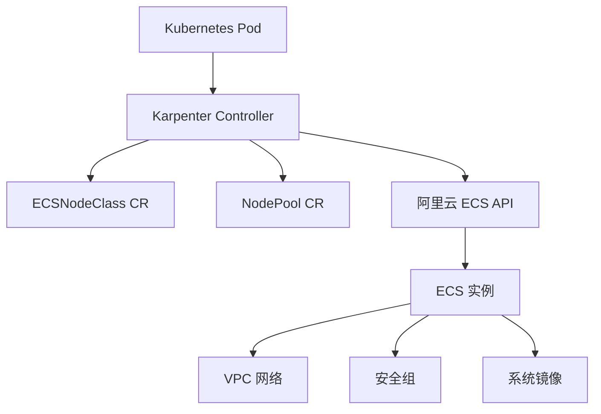

# Alibaba Cloud Karpenter Provider

[](https://goreportcard.com/report/github.com/AliyunContainerService/karpenter-provider-alibabacloud)
[](https://github.com/AliyunContainerService/karpenter-provider-alibabacloud/blob/main/LICENSE)

Alibaba Cloud Karpenter Provider 是一个为 [Karpenter](https://github.com/aws/karpenter) 项目提供的阿里云实现，用于在阿里云上自动管理 Kubernetes 节点。

## 功能特性

- **自动扩缩容**: 根据工作负载需求自动创建和删除节点
- **多可用区支持**: 自动在多个可用区间分布节点
- **灵活配置**: 通过 ECSNodeClass 和 NodePool CRD 灵活配置节点属性
- **阿里云原生**: 深度集成阿里云 ECS、VPC、安全组等服务

## 架构图



## 支持功能

### NodeClass 属性支持

| 属性 | 配置 |   |
|------|------|---|
| clusterID | - | ✅ |
| vSwitchSelectorTerms | id | ✅ |
|  | tag | ✅ |
| securityGroupSelectorTerms | id | ✅ |
|  | tag | ✅ |
| imageSelectorTerms | id | ✅ |
|  | imageFamily | ✅ |
| systemDisk | - | ✅ |
| dataDisk | - | ✅ |

### NodePool 属性支持

| 属性 | 配置 |  |
|------|------|----|
| karpenter.sh/capacity-type | 仅支持按量付费 | ✅  |
| node.kubernetes.io/instance-type | 多实例规格 | ✅  |
| topology.kubernetes.io/zone | 多可用区 | ✅  |


## 快速开始

请参考 [快速开始指南](QUICK_START.md) 了解如何部署和使用 Alibaba Cloud Karpenter Provider。

## RRSA 使用指导

RRSA (RAM Roles for Service Accounts) 是阿里云提供的一种安全认证方式，允许 Pod 通过 ServiceAccount 获取临时凭证访问云服务，无需使用长期 AK/SK。

如需使用 RRSA，请参考官方文档：
- [中文文档](https://help.aliyun.com/zh/ack/ack-managed-and-ack-dedicated/user-guide/use-rrsa-to-authorize-pods-to-access-different-cloud-services)
- [English Document](https://www.alibabacloud.com/help/en/cs/user-guide/use-rrsa-to-configure-ram-permissions-for-serviceaccount-to-implement)

### 配置步骤

#### 1. 在集群中启用 RRSA 功能

首先需要在 ACK 集群中启用 RRSA 功能，请参考上述官方文档进行操作。

#### 2. 创建 OIDC 身份提供商的 RAM 角色

创建一个 RAM 角色，并配置 OIDC 身份提供商作为信任实体。

#### 3. 给 RAM 角色授权策略

为 RAM 角色添加以下自定义权限策略：

```json
{
  "Version": "1",
  "Statement": [
    {
      "Effect": "Allow",
      "Action": [
        "cs:DescribeClusterAttachScripts",
        "cs:GetClusterAddonInstance",
        "cs:DescribeClusterDetail"
      ],
      "Resource": "*"
    },
    {
      "Effect": "Allow",
      "Action": [
        "ecs:RunInstances",
        "ecs:DescribeInstances",
        "ecs:DeleteInstances",
        "ecs:TagResources",
        "ecs:CreateLaunchTemplate",
        "ecs:DescribeLaunchTemplates",
        "ecs:DeleteLaunchTemplate",
        "ecs:DescribeInstanceTypeResource",
        "ecs:DescribeImages",
        "ecs:DescribeSecurityGroups",
        "ecs:DescribeCapacityReservations",
        "ecs:DescribePrice",
        "ecs:DescribeInstanceTypes",
        "ecs:DescribeZones"
      ],
      "Resource": "*"
    },
    {
      "Effect": "Allow",
      "Action": "vpc:DescribeVSwitches",
      "Resource": "*"
    },
    {
      "Effect": "Allow",
      "Action": "ram:GetRole",
      "Resource": "*"
    }
  ]
}
```

#### 4. 配置 Helm Chart Values

在部署 Karpenter 时，需要在 Helm chart 的 values.yaml 中配置 RRSA 相关的环境变量：

```yaml
controller:
  env:
    # RRSA 配置
    - name: ALIBABA_CLOUD_ROLE_ARN
      value: "acs:ram::<your-account-id>:role/<your-role-name>"
    - name: ALIBABA_CLOUD_OIDC_PROVIDER_ARN
      value: "acs:ram::<your-account-id>:oidc-provider/<your-oidc-provider-id>"
    - name: ALIBABA_CLOUD_OIDC_TOKEN_FILE
      value: "/var/run/secrets/ack.alibabacloud.com/rrsa-tokens/token"
```

其中：
- `ALIBABA_CLOUD_ROLE_ARN`: RAM 角色的 ARN，格式为 `acs:ram::<账号ID>:role/<角色名称>`
- `ALIBABA_CLOUD_OIDC_PROVIDER_ARN`: OIDC 身份提供商的 ARN，格式为 `acs:ram::<账号ID>:oidc-provider/<集群ID>`
- `ALIBABA_CLOUD_OIDC_TOKEN_FILE`: OIDC Token 文件路径，使用默认值即可

## 配置示例

### ECSNodeClass 配置

```yaml
apiVersion: karpenter.alibabacloud.com/v1alpha1
kind: ECSNodeClass
metadata:
  name: default
spec:
  # 集群 ID
  clusterID: ""
  # VSwitch 选择器
  vSwitchSelectorTerms:
    - tags:
        karpenter.sh/discovery: my-cluster
    - id: "vsw-bp1h5w****"
  
  # 安全组选择器
  securityGroupSelectorTerms:
    - tags:
        karpenter.sh/discovery: my-cluster
    - id: "sg-bp1h5w****"
  
  # 镜像选择器
  imageSelectorTerms:
    - imageFamily: "acs:alibaba_cloud_linux_3_2104_lts_x64"
    - id: "aliyun_3_x64_20G_container_optimized_alibase_20250629.vhd"
```

### NodePool 配置

```yaml
apiVersion: karpenter.sh/v1
kind: NodePool
metadata:
  name: default
spec:
  template:
    spec:
      requirements:
        - key: karpenter.sh/capacity-type
          operator: In
          values: ["on-demand"]
        - key: node.kubernetes.io/instance-type
          operator: In
          values: ["ecs.g6.large"]
      nodeClassRef:
        name: default
        group: karpenter.alibabacloud.com
        kind: ECSNodeClass
  limits:
    cpu: "100"
  disruption:
    consolidationPolicy: WhenEmptyOrUnderutilized
    consolidateAfter: 720h
```

## 开发指南

### 构建项目

```bash
make build
```

### 运行测试

```bash
make test
```

### 本地调试

```bash
make run
```

## 贡献

欢迎提交 Issue 和 Pull Request 来改进 Alibaba Cloud Karpenter Provider。

## 许可证

本项目采用 Apache-2.0 许可证。详情请见 [LICENSE](LICENSE) 文件。