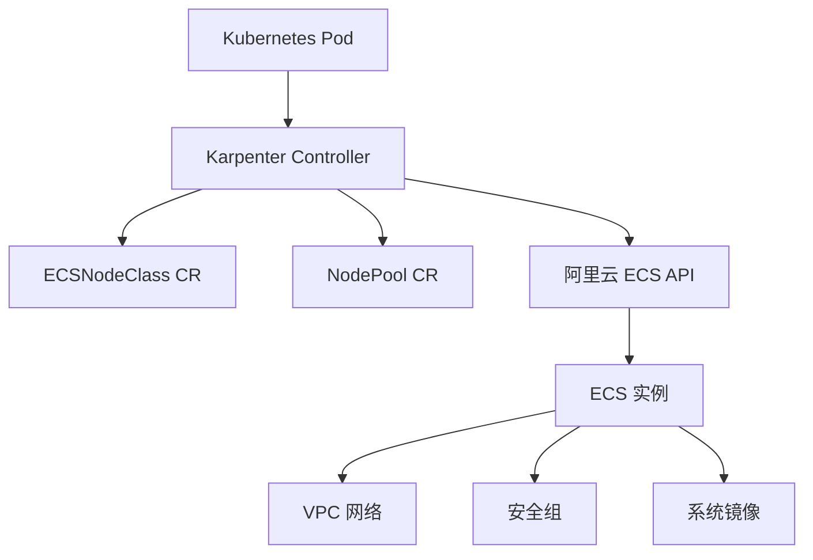

# Alibaba Cloud Karpenter Provider

[](https://goreportcard.com/report/github.com/AliyunContainerService/karpenter-provider-alibabacloud)
[](https://github.com/AliyunContainerService/karpenter-provider-alibabacloud/blob/main/LICENSE)

Alibaba Cloud Karpenter Provider 是一个为 [Karpenter](https://github.com/aws/karpenter) 项目提供的阿里云实现，用于在阿里云上自动管理 Kubernetes 节点。

## 功能特性

- **自动扩缩容**: 根据工作负载需求自动创建和删除节点
- **多可用区支持**: 自动在多个可用区间分布节点
- **灵活配置**: 通过 ECSNodeClass 和 NodePool CRD 灵活配置节点属性
- **阿里云原生**: 深度集成阿里云 ECS、VPC、安全组等服务

## 架构图



## 快速开始

请参考 [快速开始指南](QUICK_START.md) 了解如何部署和使用 Alibaba Cloud Karpenter Provider。

## 配置示例

### ECSNodeClass 配置

```yaml
apiVersion: karpenter.alibabacloud.com/v1alpha1
kind: ECSNodeClass
metadata:
  name: default
spec:
  # VSwitch 选择器
  vSwitchSelectorTerms:
    - tags:
        karpenter.sh/discovery: my-cluster
  
  # 安全组选择器
  securityGroupSelectorTerms:
    - tags:
        karpenter.sh/discovery: my-cluster
  
  # 镜像选择器
  imageSelectorTerms:
    - id: "aliyun_3_x64_20G_container_optimized_alibase_20250629.vhd"
```

### NodePool 配置

```yaml
apiVersion: karpenter.sh/v1
kind: NodePool
metadata:
  name: default
spec:
  template:
    spec:
      requirements:
        - key: karpenter.sh/capacity-type
          operator: In
          values: ["on-demand"]
        - key: node.kubernetes.io/instance-type
          operator: In
          values: ["ecs.g6.large"]
      nodeClassRef:
        name: default
        group: karpenter.alibabacloud.com
        kind: ECSNodeClass
  limits:
    cpu: "100"
  disruption:
    consolidationPolicy: WhenEmptyOrUnderutilized
    consolidateAfter: 720h
```

## 开发指南

### 构建项目

```bash
make build
```

### 运行测试

```bash
make test
```

### 本地调试

```bash
make run
```

## 贡献

欢迎提交 Issue 和 Pull Request 来改进 Alibaba Cloud Karpenter Provider。

## 许可证

本项目采用 Apache-2.0 许可证。详情请见 [LICENSE](LICENSE) 文件。